<h2 align="left">👋 Sobre Mim</h2>

Olá! Meu nome é Sara e sou graduada em Sistemas de Informação pela Universidade Federal de Uberlândia (UFU).

Atuo como desenvolvedora Front-end desde 2025, com experiência em desenvolvimento web utilizando HTML, CSS, JavaScript e React. Também tenho experiência com integração de APIs REST, criação de interfaces responsivas e aplicação de boas práticas de UI/UX e acessibilidade.

Atualmente, busco continuar evoluindo como desenvolvedora, aprimorando meus conhecimentos em Front-end, React e desenvolvimento de aplicações web.

Para saber mais: https://sararrmuniz.github.io/sobre-mim-portifolio/

---

<h2 align="left">💻 Tecnologias</h2>

  
  
  
  
  
  
  
  
  
  
  
  
  
  
  
  
  
  
  

---

<h2 align="left">📊 Estatísticas</h2>

  

  

 

  

 

---

<h2 align="left">🌐 Redes Sociais</h2>

  

  

